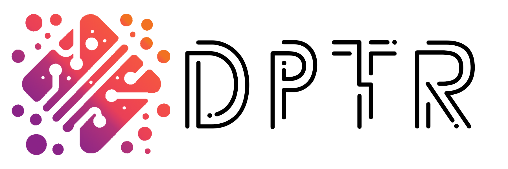

<!-- # DPTR: Differentiable PoinT Renderer -->
<!-- ```
Differentiable PoinT Renderer, backend for POINTRIX.
 ____  ____ _____ ____  
|  _ \|  _ \_   _|  _ \ 
| | | | |_) || | | |_) |
| |_| |  __/ | | |  _ < 
|____/|_|    |_| |_| \_\
``` -->

<!-- 
 -->


<div align="center">
    <p align="center">
      <picture>
      <source srcset="./media/dptr_landscape_w.png" media="(prefers-color-scheme: dark)">
      <source srcset="./media/dptr_landscape_b.png" media="(prefers-color-scheme: light)">
      
      </picture>
  </p>
  <p align="center">
    Differentiable PoinT Renderer, backend for POINTRIX.
    <br />
    <a href="https://pointrix-project.github.io/pointrix/">
    <strong>| 🏠 Pointrix | </strong></a>
    <a href="https://pointrix-project.github.io/pointrix/">
    <strong>📄 Report | </strong></a>
    <a href="https://pointrix-project.github.io/pointrix/index.html">
    <strong>🌐 Document | </strong></a>
    <br />
    <br />
  </p>
</div>

[](https://hits.seeyoufarm.com)


The **D**ifferentiable **P**oin**T** **R**enderer (**DPTR**), serving as the backend of [POINTRIX](https://github.com/pointrix-project/pointrix), is designed to offer foundational functionalities for differentiable point cloud rendering. Presently, DPTR exclusively supports tile-based 3D Gaussian Splatting rasterization. However, the roadmap includes the incorporation of additional point-based rendering primitives.

The shape of DPTR logo is generated by [Microsoft Designer](https://designer.microsoft.com/) with a prompt: *A minimalist logo with a solid white background throughout, an irregular splash graphic in the middle, the splash graphic in gradient colours, and white dots and lines in the splash graphic to form the circuit board.* The front used in logo is Potra Font, designed by Alejo Bergmann. 

## How to install
1. Install from source
```shell
# clone the code from github
git clone https://github.com/pointrix-project/dptr.git --recursive
cd dptr
# install dptr
pip install .
```

2. Install from pip (Not yet.)
```shell
pip install dptr
```

## Camera Model
DPTR use a pinhole camera model:

$$dx=K[R_{cw}|t_{cw}]X$$

$$d\begin{bmatrix}
  u \\ 
  v \\ 
  1
\end{bmatrix} = \begin{bmatrix}
  f_x & 0 & c_x \\
  0 &  f_y & c_y \\
  0 & 0 & 1 \\
\end{bmatrix}\begin{bmatrix}
  r_{11} & r_{12} & r_{13} & t_1 \\
  r_{21} & r_{22} & r_{23} & t_2 \\
  r_{31} & r_{32} & r_{33} & t_3 \\
\end{bmatrix}\begin{bmatrix}
  X \\ 
  Y \\ 
  Z \\ 
  1
\end{bmatrix}$$

* $(X, Y, Z)$ is the coordinate of a 3D point in the world coordinate system.
* $(u,v)$ are the coordinate of the projection point in **pixels**, $d$ is the depth value. 
* $K$ is a matrix of intrinsic parameters in pixels. $(c_x, c_y)$ is the principal point, which is usually the image center $(\frac{W}{2},\frac{H}{2})$. $f_x$ and $f_y$ are the focal lengths.
* $R_{cw}$ and $T_{cw}$ are extrinsic parameters (view matrix) indicated **world-to-camera** transformation in  [**OpenCV/Colmap** convention](https://kit.kiui.moe/camera/#common-camera-coordinate-systems).

In our API, you need to provide the camera parameters in the following format:
- Intrinsic Parameters $[f_x, f_y, c_x, c_y]$
- Extrinsic Parameters $[R_{cw}|t_{cw}]$

## Tutorials

### Quick Start

```python
import torch
import dptr.gs as gs

H: int = ... # image height
W: int = ... # image width
intr: torch.Tensor = ... # [4,], (fx, fy, cx, cy) in pixels
extr: torch.Tensor = ... # [4, 4], camera extrinsics in OpenCV convention.
xyzs: torch.Tensor = ... # [N, 3], Gaussian centers
rgbs: torch.Tensor = ... # [N, C], Gaussian RGB features (or any other features with arbitrary channels!)
opacity: torch.Tensor = ... # [N, 1], Gaussian opacity
scales: torch.Tensor = ... # [N, 3], Gaussian scales
rotations: torch.Tensor = ... # [N, 4], Gaussian rotations in quaternion
bg: float = 0 # scalar, background for rendered feature maps

# differentiable rendering
rendered_image = gs.rasterization(
    xyzs, scales, rotations, opacity, rgbs, intr, extr, H, W, bg
) # [C, H, W]
```

This rendering process can also be broken down:
```python
# project points
(uv, depth) = gs.project_point(xyzs, intr, extr, W, H)
visible = depth != 0

# compute cov3d
cov3d = gs.compute_cov3d(scales, rotations, visible)

# ewa project
(conic, radius, tiles_touched) = gs.ewa_project(
    xyzs, cov3d, intr, extr, uv, W, H, visible
)

# sort
(gaussian_ids_sorted, tile_range) = gs.sort_gaussian(
    uv, depth, W, H, radius, tiles_touched
)

# alpha blending
rendered_image = gs.alpha_blending(
    uv, conic, opacity, rgbs, gaussian_ids_sorted, tile_range, bg, W, H,
)
```

### A 2D Example: Fitting a 2D image with Gaussian Splatting
In this tutorial, we will demonstrate step-by-step how to use DPTR to implement a simple example of fitting the DPTR logo with 3D Gaussian Splatting (3DGS) step by step.

#### Create a simple colorful 3D Gaussian class
First, we create a simplified class for colorful 3D Gaussian point cloud. The attributes we set include 3D position, scale, rotation, opacity, and RGB color, all of which are randomly initialized.
```python
class SimpleGaussian:
    def __init__(self, num_points=100000):
        
        N = int(num_points)
        self._attributes = {
            "xyz":      torch.rand((N, 3), dtype=torch.float32).cuda() * 2 - 1,
            "scale":    torch.rand((N, 3), dtype=torch.float32).cuda(),
            "rotate":   torch.rand((N, 4), dtype=torch.float32).cuda(),
            "opacity":  torch.rand((N, 1), dtype=torch.float32).cuda(),
            "rgb":      torch.rand((N, 3), dtype=torch.float32).cuda()
        }
```

Next, we set activation functions for each attribute to ensure that they always remain within reasonable bounds. For *scale*, which must be greater than 0, we use the absolute values. For *RGB color* and *opacity*, we choose the sigmoid function to constrain the range to 0 to 1. As *rotation*, represented as an unit quaternion, we use normalization function to ensure that the magnitude must be 1.

```python
        self._activations = {
            "scale": lambda x: torch.abs(x) + 1e-8,
            "rotate": torch.nn.functional.normalize,
            "opacity": torch.sigmoid,
            "rgb": torch.sigmoid
        }
```

To perform gradient-based optimization, we allow gradient computation for each attribute by setting *requires_grad_* to *true* and create an optimizer.
```python
        for attribute_name in self._attributes.keys():
            self._attributes[attribute_name] = nn.Parameter(self._attributes[attribute_name]).requires_grad_(True)
        
        self.optimizer = torch.optim.Adam(list(self._attributes.values()), lr=0.01)
```

We encapsulate each backward step and gradient zeroing into a function.
```python
    def step(self):
        self.optimizer.step()
        self.optimizer.zero_grad()
```

Then, we need a function to retrieve the attributes of the 3D Gaussian, returning the corresponding activated attributes according to the name.
```python
    def get_attribute(self, name):
        try:
            if name in self._activations.keys() and self._activations[name] is not None:
                return self._activations[name](self._attributes[name])
            else:
                return self._attributes[name]
        except:
            raise ValueError(f"Attribute or activation for {name} is not VALID!")
```

#### Read the target logo image
Read the logo image, normalize it, and then convert it into a tensor with a shape of [C, H, W].
```python
    img = imageio.imread("./media/dptr_logo.png")
    img = img.astype(np.float32) / 255.0
    img = img[:, :, 0:3] * img[:, :, 3:] + 1.0 * (1 - img[:, :, 3:])
    gt = torch.from_numpy(img).cuda().permute(2, 0, 1)
    
    C, H, W = gt.shape
```

#### Set a Camera
```python
    bg = 1
    fov = math.pi / 2.0
    fx = 0.5 * float(W) / math.tan(0.5 * fov)
    fy = 0.5 * float(H) / math.tan(0.5 * fov)
    intr = torch.Tensor([fx, fy, float(W) / 2, float(H) / 2]).cuda().float()
    extr = torch.Tensor([[1.0, 0.0, 0.0, 0.0],
                         [0.0, 1.0, 0.0, 0.0],
                         [0.0, 0.0, 1.0, 2.5]]).cuda().float()
```

#### Train
Create a 3D Gaussian point cloud and optimize it!
```python
    gaussians = SimpleGaussian(num_points=10000)

    max_iter = 2000
    frames = []
    progress_bar = tqdm(range(1, max_iter), desc="Training")
    cal_loss = nn.SmoothL1Loss()

    for iteration in range(0, max_iter):
        
        rendered_feature = gs.rasterization(
            gaussians.get_attribute("xyz"),
            gaussians.get_attribute("scale"),
            gaussians.get_attribute("rotate"), 
            gaussians.get_attribute("opacity"),
            gaussians.get_attribute("rgb"),
            intr,
            extr,
            W, H, bg)
        
        loss = cal_loss(rendered_feature, gt)
        loss.backward()
        gaussians.step()
        
        progress_bar.set_postfix({"Loss": f"{loss:.{7}f}"})
        progress_bar.update(1)
        
        if iteration % 20 == 0:
            render = rendered_feature.detach().permute(1, 2, 0)
            render = torch.clamp(render, 0.0, 1.0)
            render = (render.cpu().numpy() * 255).astype(np.uint8)
            
            empty = np.ones((render.shape[0], 2, 3), dtype=np.uint8)
            show_data = np.hstack((render, empty, (img * 255).astype(np.uint8)))
            frames.append(show_data)
    
    progress_bar.close()
```

We then save the results in the optimization process as a GIF image.
```python
    frames = np.stack(frames, axis=0)
    imageio.mimwrite("tutorial_2d.mp4", frames, fps=30)
```
This current result looks pretty good, although certain details are not so perfect. To solve this problem, we could perform more iterations and use more Gaussian points, although this would extend the time needed to complete the optimization process.

The complete code for this tutorial can be found [here](./tutorials/gs_2d.py). And you could easily run it by:
```shell
pip install -U imageio numpy tqdm opencv-python

python tutorials/gs_2d.py
```

### 3D Example: Fitting a 3D mesh with Gaussian splatting

We also provide a tutorial for fitting a 3D mesh with Gaussian splatting [here](./tutorials/gs_3d.py):
```shell
pip install -U imageio numpy tqdm tyro kiui 
pip install git+https://github.com/NVlabs/nvdiffrast

python tutorials/gs_3d.py --mesh <path/to/mesh.obj>
```
